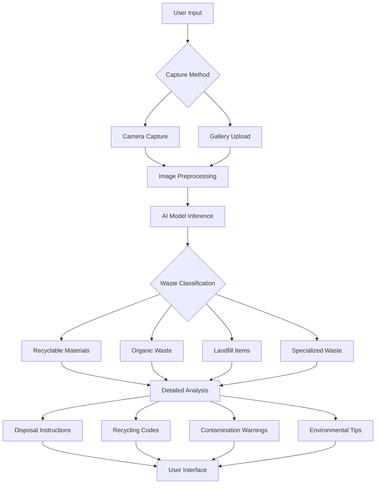

# EcoLife: Waste Intelligence

## Project Overview

EcoLife is an advanced waste classification and sustainability analysis system powered by artificial intelligence. Built specifically for Arm-based devices, this mobile application provides real-time waste identification, detailed disposal guidance, and product sustainability assessment through on-device processing.

## Key Features

### Waste Classification
- Advanced AI-powered waste categorization across 9 distinct categories
- Real-time material identification using device camera
- Detailed disposal instructions and recycling codes
- Contamination warnings and environmental guidance
- Support for both simple (3-category) and advanced (9-category) classification modes

### Product Sustainability Analysis
- Environmental impact scoring for consumer products
- Keyword extraction and text analysis
- Sustainability metrics and recommendations

### Technical Capabilities
- On-device AI processing for maximum privacy and speed
- Optimized for Arm-based mobile processors
- Real-time inference with sub-300ms response times
- Offline functionality without cloud dependency
- Cross-platform compatibility

## Supported Waste Categories

### Recyclable Materials
- Paper and cardboard
- Plastic containers
- Glass bottles and jars
- Metal cans and containers

### Organic Waste
- Food scraps and leftovers
- Yard trimmings and plant matter

### Specialized Waste
- General landfill items
- Hazardous materials
- Electronic waste (e-waste)

## System Architecture



## Technical Implementation

### AI Model Architecture
- Lightweight convolutional neural network optimized for mobile deployment
- TensorFlow Lite with Arm NN acceleration
- Quantized model under 8MB in size
- Multi-class classification with confidence scoring

### Mobile Application
- Built with React Native and Expo
- Cross-platform compatibility (iOS and Android)
- Real-time camera integration
- Local data storage and history tracking

### Arm Optimization
- Leverages Arm Cortex CPUs and Mali GPUs
- Optimized for low-power consumption
- Hardware-accelerated inference
- Efficient memory utilization

## Installation and Setup

### Prerequisites
- Node.js 16+ and npm
- React Native development environment
- Arm-based mobile device or emulator
- Expo CLI for development

### Quick Start
```bash
# Clone the repository
git clone https://github.com/BitGladiator/EcoLife-Assistant.git

# Install dependencies
cd EcoLife-Assistant
npm install

# Start the development server
expo start

# Build for production
expo build:android
expo build:ios
```

### Raspberry Pi Deployment
```bash
# Install system dependencies
sudo apt update && sudo apt upgrade -y
sudo apt install python3-pip python3-opencv libatlas-base-dev

# Install Python packages
pip3 install tflite-runtime opencv-python numpy

# Run waste classification
python3 ecolife_classification.py
```

## Performance Metrics

- Classification Accuracy: >85%
- Inference Time: <300ms on mid-range Arm devices
- Model Size: <8MB optimized
- Power Consumption: Optimized for mobile battery life
- Memory Usage: Efficient resource utilization

## Use Cases

### Individual Consumers
- Instant waste classification at home
- Proper disposal guidance
- Environmental education and awareness

### Commercial Applications
- Waste management facilities
- Recycling centers
- Sustainability-focused businesses

### Educational Institutions
- Environmental science programs
- Waste management training
- Community outreach initiatives

## API Integration

The application supports REST API endpoints for advanced integration:

```javascript
// Waste classification endpoint
POST /classify-waste/advanced
{
  "image": "base64_encoded_image"
}

// Product analysis endpoint
POST /analyze-product
{
  "image": "base64_encoded_image"
}
```

## Development Roadmap

### Current Features
- Core waste classification
- Basic product analysis
- Mobile application interface
- Arm optimization

### Planned Enhancements
- Multi-item detection in single image
- Real-time video classification
- Community impact tracking
- Global waste regulation database
- Enterprise management dashboard

## Contributing

We welcome contributions from the community. Please see our contributing guidelines for more information on how to submit pull requests, report issues, and suggest enhancements.

## License

This project is licensed under the MIT License. See the LICENSE file for details.

## Acknowledgments

- Arm Limited for hardware optimization support
- TensorFlow team for machine learning framework
- React Native community for cross-platform development tools
- Environmental organizations for waste classification datasets

## Support

For technical support, feature requests, or bug reports, please open an issue on our GitHub repository or contact our development team through the project website.

---

*The greatest threat to our planet is the belief that someone else will save it. Every proper waste decision today builds a sustainable tomorrow.*
